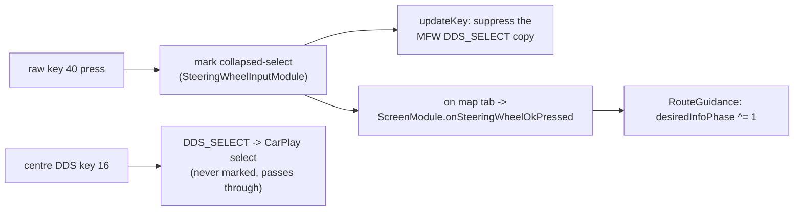

# Steering-wheel roller - zoom & route-info toggle

The left MFW roller has two distinct axes: **rotation** (scroll) and **press** (click).

## 📋 Context

> MFW roller -> **rotation** = CarPlay AltScreen map zoom (via `WheelZoomBridge`) - **press** = cluster route-info toggle (Next Street ↔ ETA / trip summary) ->
> [bap-fctids](../rgd/bap-fctids.md) FctID 19 -> [rgd-activation](../rgd/rgd-activation.md).

## 🔄 Rotation (scroll) -> CarPlay AltScreen Zoom

The roller rotation is delivered to `ClusterService.onMagnificationChanged(int i)`.
On the `altScreen` branch:
1. `WheelZoomBridge.onMagnificationChanged(i)` computes the delta steps and direction (`0` = Zoom In, `1` = Zoom Out).
2. When CarPlay owns the cluster (Context 80), it appends formatted events to `/tmp/mmi-mirror-wheel-zoom.events`.
3. `libcarplay_altscreen.so` polls this event queue and dispatches native `changeMapZoomLevel` commands to Apple CarPlay over the secondary screen control plane.
4. When cruising or outside Context 80, the zoom steps fall through to stock.

## ⚙️ Press (OK) -> route-info toggle

The raw MFW roller press (DSI key 40, `KEY_MFW_ROLLER_LEFT`) and the centre-console DDS (key 16,
`KEY_DDS`) both collapse to the same `DDS_SELECT` in the stock keyboard stack. `SteeringWheelInputModule`
observes the raw `ATTR_KEY2` stream and marks only key 40, so `CarplayDSILifecycleController.updateKey`
can **suppress that one copy** of `DDS_SELECT` before it reaches iOS (via `consumeCollapsedSelect`) -
the centre knob still selects in the CarPlay Main UI.

Gated to the confirmed VC map tab, the press then calls `ScreenModule.onSteeringWheelOkPressed()` ->
`RouteGuidance` toggles the cluster route-info line between the **next turn-to street** (phase 0) and
the **trip summary** (ETA / arrival clock + remaining, phase 1). Phase 1 falls back to phase 0 by
itself 20 s after it was published. Text layout: [vc-route-text](../rgd/vc-route-text.md) (FctID 19).

